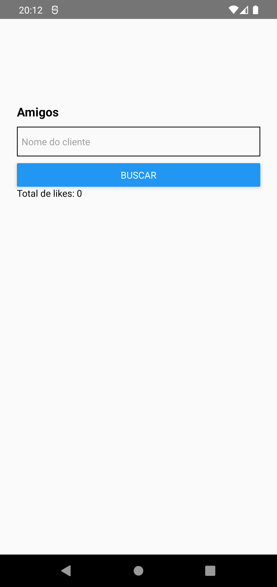
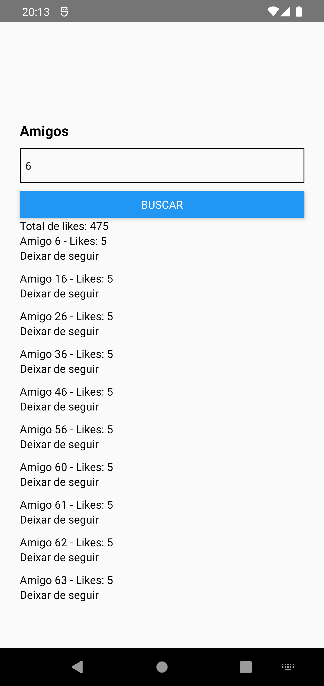

# Performance App - Ignite

<p align="center">
  
  
  
  
</p>

<p align="center">
  <a href="#sobre">Sobre</a> •
  <a href="#performance-app">Performance App</a> •
  <a href="#instalação">Instalação</a> •
  <a href="#tecnologias">Tecnologias</a> •
  <a href="#autor">Autor</a>  
</p>

## Sobre

Projeto desenvolvido durante o bootcamp Ignite da Rocketseat na trilha de React Native.

## Performance App

O Performance app é uma aplicação construída durante o módulo de performance na trilha de React Native do Ignite.

Como o foco aqui foi entender questões de performance dentro da tecnologia, o app desenvolvido foi bastante simples e basicamente trata-se de uma listagem de dados retornados de uma API REST.

Por mais simples que seja, exploramos nesse app conceitos importantes que aprimoram muito nossas aplicações, tornando-as mais performáticas, principalmente quando há cálculos e listagens extensas de dados, como é o caso explorado aqui.

Deixo abaixo screenshots da aplicação sem e com os resultados retornados da API e logo no final do tópico uma demonstração da aplicação em funcionamento:

|                             Home vazia                              |                   Home com resultados                   |
| :-----------------------------------------------------------------: | :-----------------------------------------------------: |
|  |  |

Deixo abaixo uma pequena demonstração da aplicação em funcionamento na qual passo por todos os fluxos do app para fins demonstrativos:


## Instalação

Antes de começar, você vai precisar ter instalado em sua máquina as seguintes ferramentas:
[Git](https://git-scm.com) e [Node.js](https://nodejs.org/en/). Além disso é bom ter um editor para trabalhar com o código como [VSCode](https://code.visualstudio.com/).

### 📱 Rodando o App (Mobile)

```bash
# Clone este repositório
$ git clone git@github.com:MrRioja/performanceApp.git

# Acesse a pasta do projeto no terminal/cmd
$ cd performanceApp

# Instale as dependências
$ npm install
# Caso prefira usar o Yarn execute o comando abaixo
$ yarn

# Execute o bundle
$ npm run start
# Caso prefira usar o Yarn execute o comando abaixo
$ yarn start

# Execute o app em um emulador android ou iOS
$ npm run [android | ios]
# Caso prefira usar o Yarn execute o comando abaixo
$ yarn [android | ios]

# Execute a API feita com JSON server (mude o IP do comando no package.json)
$ yarn server
```

## Tecnologias

[](https://skillicons.dev)

## Autor

<div align="center">

<h1>Luiz Rioja</h1>
<strong>Backend Developer</strong>
<br/>
<br/>

<a href="https://linkedin.com/in/luizrioja" target="_blank">

</a>

<a href="https://github.com/mrrioja" target="_blank">

</a>

<a href="mailto:lulyrioja@gmail.com?subject=Fala%20Dev" target="_blank">

</a>

<a href="https://api.whatsapp.com/send?phone=5511933572652" target="_blank">

</a>

<a href="https://join.skype.com/invite/tvBbOq03j5Uu" target="_blank">

</a>

<br/>
<br/>
</div>
